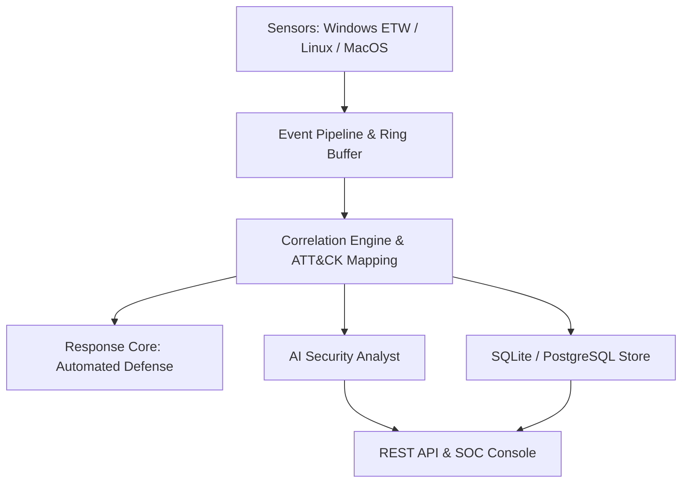

# R3TRIVE Documentation

> **Endpoint detection, threat hunting and automated defense at scale.**

Welcome to the official documentation for **R3TRIVE**.

R3TRIVE is a cross-platform cybersecurity platform built for **defensive security operations**. It combines behavioral endpoint detection, AI-assisted investigation, automated response, and threat hunting into a single portable binary.

---

## Quick Navigation

| Document | Description |
|---|---|
| [System Architecture](system_architecture.md) | Component architecture, data flows, and concurrency model |
| [Detection Engine](detection_engine.md) | Behavioral detection internals, sensors, and event pipeline |
| [Rule Engine](rule_engine.md) | Rule grammar, behavioral correlation DSL, YARA, and Sigma |
| [AI Security Analyst](ai_analyst.md) | AI layer architecture, RAG vector search, prompting & safety |
| [Threat Model](threat_model.md) | Threat actors, attack vectors, mitigations, and STRIDE analysis |
| [Automated Response & SOC Playbooks](soc_workflow.md) | SOC integration, triage playbooks, and automated defense |
| [Database Schema](database_schema.md) | Full relational schema for events, alerts, incidents, and hosts |
| [Plugin SDK](plugin_sdk.md) | Integration interfaces for SIEMs, EDRs, ticketing, and feeds |
| [REST API Reference](api_reference.md) | REST API endpoints, schemas, authentication, and responses |
| [Contributing Guide](contributing.md) | Guidelines for contributing code, rules, and documentation |

---

## Core Capabilities

- **Endpoint Monitoring**: Continuous behavioral observation of process execution, file modifications, network sockets, and registry operations.
- **Behavioral Correlation**: High-throughput temporal pattern matching mapped to MITRE ATT&CK techniques with configurable thresholds and sliding time windows.
- **Automated Response**: Sub-second containment actions including process termination, firewall IP blocking, and secure file quarantining.
- **AI Analyst**: Context-rich attack chain reconstruction, incident summarization, and natural language threat queries powered by local or remote LLMs.
- **Unified Rule Formats**: Native support for custom R3TRIVE YAML rules, YARA rulesets, and Sigma hunting signatures.
